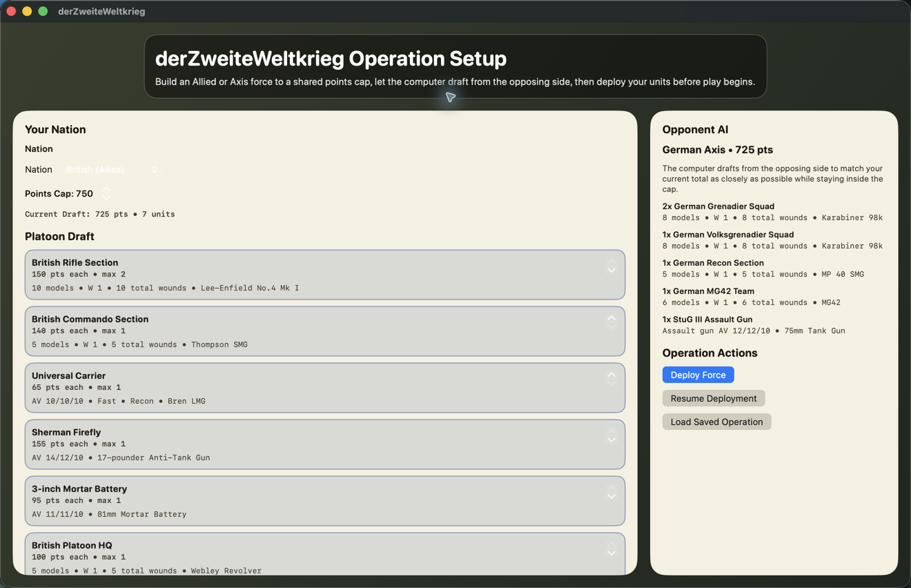
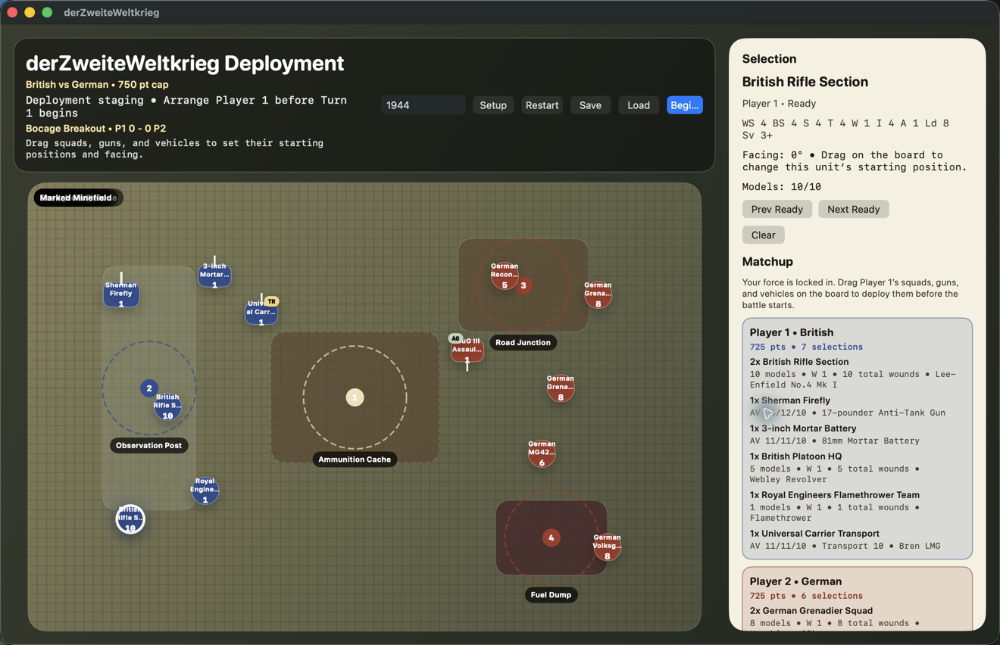

# derZweiteWeltkrieg

`derZweiteWeltkrieg` is a playable macOS/SwiftUI and C tabletop wargame demo set in World War II.

The demo opens on `Bocage Breakout`, an Allies-vs-Axis objective battle where the player can build or load a force, deploy, move, shoot, use artillery and transports, resolve vehicle damage, assault, score objectives, and finish a match.

## Screenshots





- C rules engine: `Sources/DerZweiteWeltkriegCore`
- SwiftUI app: `Sources/DerZweiteWeltkriegApp`
- Swift tests: `Tests/DerZweiteWeltkriegTests`
- Development roadmap: `docs/wwii_development_roadmap.md`
- Final demo checklist: `docs/wwii_demo_completion_checklist.md`
- Demo scope: `docs/wwii_demo_scope.md`
- WWII weapon taxonomy: `docs/wwii_weapon_taxonomy.md`
- WWII unit profile ledger: `docs/wwii_unit_profiles.md`
- WWII armor and artillery ledger: `docs/wwii_armor_profiles.md`
- WWII battlefield profile ledger: `docs/wwii_battlefield_profiles.md`
- Order-dice baseline audit: `docs/order_dice_baseline_audit.md`
- Order-dice rules model: `docs/order_dice_rules_model.md`
- Order-dice activation contract: `docs/order_dice_activation_contract.md`
- Order tests and FUBAR contract: `docs/order_tests_and_fubar_contract.md`

## Game Systems

The demo covers the systems needed for a World War II tabletop battle:

- turn sequencing and phase control
- infantry and vehicle movement
- difficult and impassable terrain
- shooting, armour saves, cover saves, morale, pinning, and mixed-profile hit allocation
- flame, blast, ordnance, and barrage-style weapons
- vehicle damage, smoke, hull-down checks, transports, passenger damage, embarked firing, and mounted fire arcs
- infantry assaults, infantry-vs-vehicle assaults, close-combat allocation, combat resolution, fall back, advance, and consolidation
- objective scoring and win detection

## Run

Open `DerZweiteWeltkriegDemo.xcodeproj` in Xcode and run the shared `DerZweiteWeltkriegApp` scheme. The setup screen starts with a British force drafted and an Axis opponent ready; choose `Deploy Force` to place units and begin the battle.

For the standalone C battle report, open `DerZweiteWeltkriegCommandLine.xcodeproj` and run the shared `DerZweiteWeltkriegCommandLine` scheme.

Or use the Swift package directly:

```bash
swift build
swift run DerZweiteWeltkriegApp
```

## Development Status

The World War II demo is playable. The app supports Allies and Axis nation setup for British, American, Australian, Soviet, German, and Italian forces. The current build includes a ready-to-deploy default operation, nation-appropriate demo weapon mappings, a World War II command-line battle report, run-guide documentation, the demo completion checklist, and staged order-dice migration primitives.
